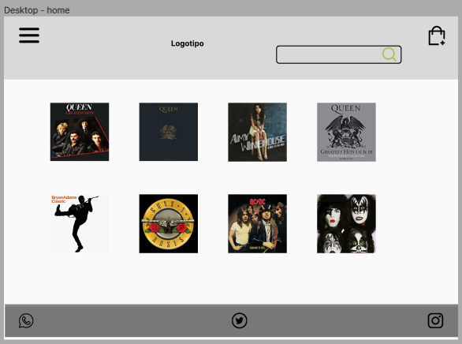

## Project name

<div align="center"> 
  
</div>

## Description
The project consist in design and develop a Marketplace

- About the ***VINILART*** App:

Our objective is to provide a platform for music enthusiasts to easily discover and purchase antique music albums online. We aim to satisfy the increasing demand for old albums by offering a wide selection of LPs, giving customers the opportunity to find and purchase the albums they are looking for. Our website has been designed with a user-friendly interface, including a navbar, body, and footer with all the necessary functions to provide a seamless shopping experience for our customers.
DEMO :https://vinil-art.vercel.app/

***

## Table of contents
* [Team Members](#team-members)
* [Screenshots](#screenshots)
* [Technologies](#stacks)
* [Installation](#how-to-install-this-project)
* [Tests](#tests)
* [Methodology](#methodology)
* [Core skills](#core-skills)
* [Next Steps](#next-steps)

***

## Team Members
- [Alejandra Morales Cuitiño](https://github.com/AleMCuitino) - SCRUM Master
- [Ana Rueda Guiu](https://github.com/anaruedaguiu) - Product Owner
- [Elena Pulido Alvaré](https://github.com/elenapulido) - Developer
- [Belén Zumalacarregui](https://github.com/belenz77) - Developer
- [Iyán Pérez Marcos](https://github.com/IyanPerez) - Developer
- [Luis Custodio](https://github.com/Custodioluis) - Developer
- [Shima Naderi](https://github.com/Archima20) - Developer
- [Taoufik](https://github.com/taoufikL12) - Developer
- [Laura]() - Developer
- [Diana]() - Developer

***

## Screenshots

<h3 align="center">Sketch Home and Product View - Desktop</h3>
<p align="center"> 
    
    
</p>


<h3 align="center">Mockups Views: Home, Product and Cart - Desktop</h3>
<p align="center"> 
    
    
    
</p>

<h3 align="center">Mockups Views: Home, Product and Cart - Mobile</h3>
<p align="center"> 
    
    
    
</p>

***


## Stacks

- HTML 5
- CSS 3
- Tailwind
- PHP 8.0.2
- Laravel Framework 9.19
- Postman for Windows Version 10.10.8
- React 18.2.0
- React Router Dom 6.8.1
- MySQL

***

## How to install this project
  **BACK** 
* Clone git https://github.com/anaruedaguiu/apiHackathon.git
* Create a local database on phpMyAdmin:
  - Database name: ***universalsounds***
* Create an .env file by copying the contents of .env.example and modify the database name (laravel by universalsounds)
* Install dependencies in a Visual Studio Code terminal:
  - Run ***npm install*** or ***npm update*** command
  - Run ***composer install***
* Activate the server and keep this terminal open:
  - Run ***npm run dev*** command
* Run the server in a Visual Studio Code new terminal using (and keep this terminal open):
  - ***php artisan serve*** command
* Run migration:
  - ***php artisan migration:fresh --seed*** command

  **FRONT**
* Clone git https://github.com/AleMCuitino/universal-sounds-frontend.git 

* Getting Started with Create React App

This project was bootstrapped with [Create React App](https://github.com/facebook/create-react-app).

* Available Scripts

In the project directory, you can run:

* `npm start`

Runs the app in the development mode.\
Open [http://localhost:3000](http://localhost:3000) to view it in your browser.

The page will reload when you make changes.\
You may also see any lint errors in the console.

* `npm test`

Launches the test runner in the interactive watch mode.\
See the section about [running tests](https://facebook.github.io/create-react-app/docs/running-tests) for more information.

* `npm run build`

Builds the app for production to the `build` folder.\
It correctly bundles React in production mode and optimizes the build for the best performance.

The build is minified and the filenames include the hashes.\
Your app is ready to be deployed!

See the section about [deployment](https://facebook.github.io/create-react-app/docs/deployment) for more information.

* `npm run eject`

**Note: this is a one-way operation. Once you `eject`, you can't go back!**

If you aren't satisfied with the build tool and configuration choices, you can `eject` at any time. This command will remove the single build dependency from your project.

Instead, it will copy all the configuration files and the transitive dependencies (webpack, Babel, ESLint, etc) right into your project so you have full control over them. All of the commands except `eject` will still work, but they will point to the copied scripts so you can tweak them. At this point you're on your own.

You don't have to ever use `eject`. The curated feature set is suitable for small and middle deployments, and you shouldn't feel obligated to use this feature. However we understand that this tool wouldn't be useful if you couldn't customize it when you are ready for it.

***

## Tests
To run the tests, execute the following command(s)
```bash
  php artisan test
```


```bash
  vendor/bin/phpunit tests
```


- Postman' Screenshots

Screenshots of ***Postman App*** used to check API routes.

Screenshots show how Postman returns a '200' code when routes run for each method of CRUD. In order, you can find: 
<h5 align="center">Read (Page with the list of Vinils) |  Delete | Create | Update | Show (Page with the detail of a Vinil)</h5>

<div align="center">
  <div class="d-flex flex-nowrap">
    
    
    
    
    
  </div>
</div>


***

## Methodology
- TDD
- Agile with Scrum
- Mob, pair and solo programming

***

## Core skills
* MVC Design pattern.
* Git version control system.
* User stories and tasks implementation (Trello).
* Communication and self-evaluation.

## Next Steps

This is a MVP developed for a **F5 Hackathon**. 

What would be added if there were more time?

* Implement user roles and authentication permissions (guests - users - admin). 

* Add a forum section in the App where users can exchange opinions, recommendations and suggestions about their musical tastes, promoting the development of a community where people of different generations and ages connect.

* Keep adding functionalities (pagination, buttons...)
